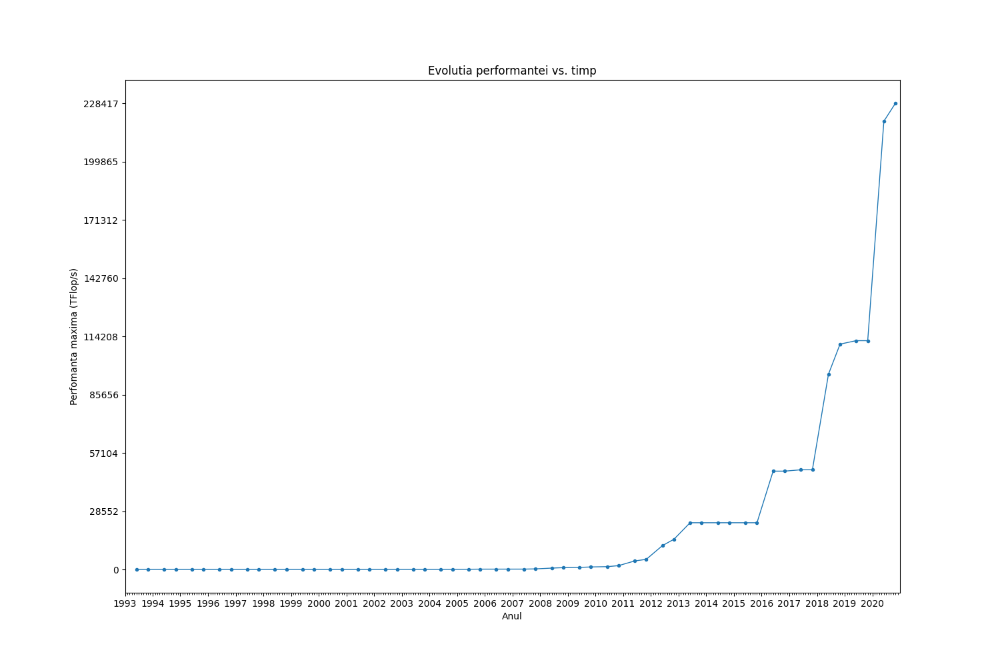

# Evolutia performantei vs. timp a calculatoarelor

## Membri

* [Gatej Andrei](https://github.com/Andrei0872)
* [Ifrosa Diana](https://github.com/DianaIfrosa)
* [Lupascu Miruna](https://github.com/MirunaStefaniaL)

---

## Rezultate

Pentru a vedea rezultate in functie de alti ani, se pot modifica valorile variabilelor `startYear` si `endYear` din fisierul `main.py`. Noile date generate pot fi gasite in folder-ul `output`.

### Grafic

  

### Progresul Mediu pe An

Conform calculelor nostre, progresul rezultat pe intervalul `1993-2020` este `1.900514041074173`.

---

## Cum functioneaza

Informatiile au fost extrase de pe site-ul [www.top500.org](https://www.top500.org/lists/top500/), urmand ca acestea sa fie *parsate* cu [Beautiful Soup](https://www.crummy.com/software/BeautifulSoup/bs4/doc/).

### Graficul evolutiei perfomantei vs. timp (cu ajutorul librariei [matplotlib](https://matplotlib.org/)): 

- Pe axa Ox consideram lunile pentru anii din intervalul dat `[startYear, endYear]`, avand date doar pentru lunile iunie si noiembrie ale fiecarui an. 
- Pe axa Oy consideram valorile mediilor aritmetice asociate fiecarei luni (`Rmax(TFlop/s)`).

*Observatie*: Considerand graficul anilor 1993-2020, in intervalul 1993-2008, se poate observa o diferenta redusa de la an la an, deoarece cresterea Rmax-ului a fost mica in comparatie cu evolutia din anii urmatori.

### Progresul mediu realizat pe an:
- Calculam pentru fiecare luna (iunie sau noiembrie) media aritmetica a primelor 3 calculatoare 
(dupa criteriul `Rmax(TFlop/s)`), iar apoi media dintre cele doua luni, obtinand media anuala.
- Am determinat rapoartele mediilor anuale dupa formula: `medie_an X/medie_an X-1`, unde `X ∈ [startYear+1, endYear]`.
- Folosind rapoartele anterior calculate am realizat media aritmetica a acestora, ceea ce reprezinta valoarea cautata.
